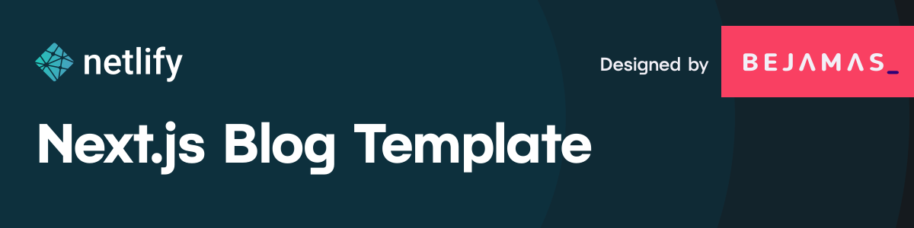

## Contributors ✨

 <table>  
   <tr><td align="center"><a href="https://github.com/Ajay-Dhangar">   <b>Ajay-Dhangar</b></a> <a href="#" title="Code">💻</a></td>     
    <td align="center"><a href="https://github.com/thomkrupa"> <b>Thom krupat</b></a> <a href="#" title="Code">💻</a></td>
    <td align="center"><a href="https://github.com/maxcell"> <b>Prince Wilson</b></a> <a href="#" title="Code">💻</a></td>
    <td align="center"><a href="https://github.com/charliegerard"> <b>Charlie</b></a> <a href="#" title="Code">💻</a></td>    
    <td align="center"><a href="https://github.com/tzmanics"> <b>Tara Z. Manicsic</b></a> <a href="#" title="Code">💻</a> </td>
    <td align="center"><a href="https://github.com/renovate-bot"> <b>Mend Renovate</b></a> <a href="#a" title="Code">💻</a></td>
    
  </tr>
 
  <tr><td align="center"><a href="https://github.com/taty2010">   <b>Tatyana</b></a> <a href="#" title="Code">💻</a></td>     
    <td align="center"><a href="https://github.com/lynnandtonic"> <b>Lynn Fisher</b></a> <a href="#" title="Code">💻</a></td>
    <td align="center"><a href="https://github.com/mcgear"> <b>Michael Gearhardt</b></a> <a href="#" title="Code">💻</a></td>
    <td align="center"><a href="https://github.com/valse"> <b>Marco Valsecchi</b></a> <a href="#" title="Code">💻</a></td>    
    <td align="center"><a href="https://github.com/MarcL"> <b>Marc Littlemore</b></a> <a href="#" title="Code">💻</a> </td>
    <td align="center"><a href="https://github.com/apps/renovate"> <b>Renovate</b></a> <a href="#a" title="Code">💻</a></td>
    
  </tr> 
    
  
  </table>

## Thanks

Made with ❤️ by <a href="https://ajay-dhangar.github.io/Responsive-portfolio-website.github.io/#home" target="_blank">Ajay-Dhangar</a>

